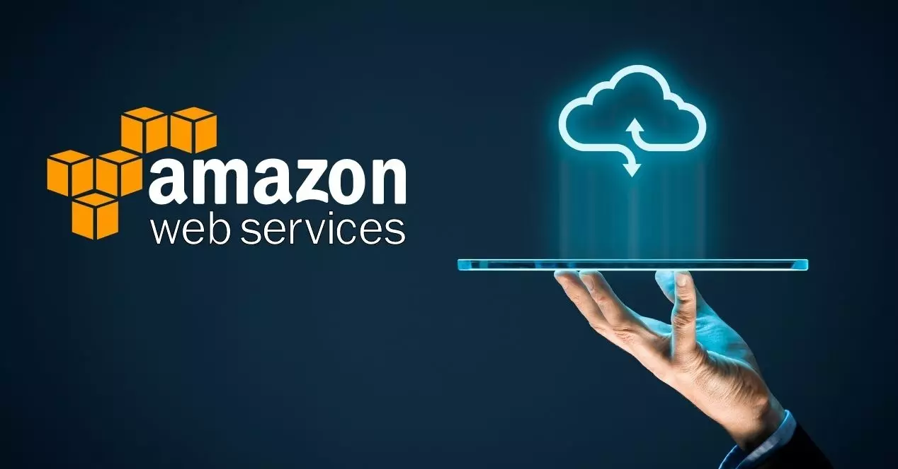

# ☁️ AWS Hands-On Practices

This repository includes structured **AWS hands-on exercises** created to strengthen practical knowledge of core AWS services.  
Each folder represents a separate topic-based lab focusing purely on **hands-on implementation** — not theory, slides, or documentation.

---

## 🎯 Purpose

The repository is dedicated exclusively to **hands-on practice**.  
It is not a note collection or lecture summary, but a technical workspace for:

- Practicing real AWS commands and configurations
- Reproducing common AWS architecture scenarios
- Testing automation scripts and CloudFormation templates
- Building repeatable infrastructure examples

---

## 🧩 Repository Structure

Each folder corresponds to a hands-on exercise:

📁 EC2 Introduction
📁 IAM
📁 NGINX-Launch_Template
📁 Volumes
📁 AMI & Snapshot
📁 JSON & YAML
📁 Load_Balancing
📁 S3_1
📁 S3_2
📁 ASG-LT
📁 EFS
📁 AWS CLI
📁 CFN ASG ALB LT
📁 Database_RDS
📁 MariaDB
📁 DB_RestoreFromSnapshot
📁 DynamoDB
📁 VPC - Part 1
📁 VPC - Part 2
📁 VPC - Part 3
📁 VPC - Part 4
📁 Route 53 - Part 1
📁 Route 53 - Part 2
📁 CloudFront
📁 WAF
📁 Lambda & API Gateway
📁 Elastic_Beanstalk
📁 SNS-SQS
📁 Boto3
📁 Cloudwatch
📁 CI/CD
📁 Iam Security

Each folder contains:

- `guide.md` or `README.md` → step-by-step exercise instructions
- `user_data.sh`, `.yaml`, or `.json` → configuration or automation files
- `screenshots/` → validation and output images

---

## 🧠 Topics Covered

| Category         | Example Hands-On Topics                                       |
| ---------------- | ------------------------------------------------------------- |
| 🖥️ EC2           | Launching instances, connecting via SSH, user data automation |
| 🔐 IAM           | User, group, and policy management                            |
| ☁️ S3            | Static website hosting, lifecycle rules, encryption           |
| 🧱 EFS & Volumes | Mounting, sharing, and performance tuning                     |
| 🧮 Databases     | RDS, MariaDB, DynamoDB, backups                               |
| 🌐 Networking    | VPC, Subnets, Route Tables, NAT, Load Balancers               |
| 📊 Monitoring    | CloudWatch metrics, alarms, logs                              |
| ⚙️ Automation    | CloudFormation, Bash scripting, Boto3                         |
| 🪄 Serverless    | Lambda, API Gateway, SNS, SQS                                 |
| 🚀 Deployment    | Elastic Beanstalk, Auto Scaling, Launch Templates             |

---

## 📁 Example Folder Format

Each hands-on includes:

1. **Objective** – What will be implemented
2. **Implementation Steps** – Commands and configurations
3. **Verification** – How to test the setup
4. **Cleanup** – Optional removal of test resources

---

## 🧾 Progress Overview

| No  | Topic                  | Folder                                               |
| --- | ---------------------- | ---------------------------------------------------- |
| 01  | EC2 Introduction       | [EC2_Introduction](./EC2_Introduction)               |
| 02  | IAM                    | [IAM](./IAM)                                         |
| 03  | NGINX Launch Template  | [NGINX-Launch_Template](./NGINX-Launch_Template)     |
| 04  | Volumes                | [Volumes](./Volumes)                                 |
| 05  | AMI & Snapshot         | [AMI_Snapshot](./AMI_Snapshot)                       |
| 06  | JSON & YAML            | [JSON_YAML](./JSON_YAML)                             |
| 07  | Load Balancing         | [Load_Balancing](./Load_Balancing)                   |
| 08  | S3 - Part 1            | [S3_1](./S3_1)                                       |
| 09  | S3 - Part 2            | [S3_2](./S3_2)                                       |
| 10  | ASG-LT                 | [ASG-LT](./ASG-LT)                                   |
| 11  | EFS                    | [EFS](./EFS)                                         |
| 12  | AWS CLI                | [CLI](./CLI)                                         |
| 13  | CFN ASG ALB LT         | [CFN-ASG-ALB-LT](./CFN-ASG-ALB-LT)                   |
| 14  | Database RDS           | [Database_RDS](./Database_RDS)                       |
| 15  | MariaDB                | [MariaDB](./MariaDB)                                 |
| 16  | DB_RestoreFromSnapshot | [DB_RestoreFromSnapshot](./DB_RestoreFromSnapshot)   |
| 17  | DynamoDB               | [DynamoDB](./DynamoDB)                               |
| 18  | VPC - Part 1           | [VPC-01_Basics](./VPC-01_Basics)                     |
| 19  | VPC - Part 2           | [VPC-02_Bastion-NAT](./VPC-02_Bastion-NAT)           |
| 20  | VPC - Part 3           | [VPC-03_Peering-Endpoint](./VPC-03_Peering-Endpoint) |
| 21  | VPC - Part 4           | [VPC-04_LAMP-and-NACL](./VPC-04_LAMP-and-NACL)       |
| 22  | Route 53 - Part 1      | [Route_53_1](./Route_53_1)                           |
| 23  | Route 53 - Part 2      | [Route_53_2](./Route_53_2)                           |
| 24  | CloudFront             | [CloudFront](./CloudFront)                           |
| 25  | WAF                    | [WAF](./WAF)                                         |
| 26  | Lambda & API Gateway   | [Lambda-APIGW](./Lambda-API_GW)                      |
| 27  | Elastic Beanstalk      | [Elastic_Beanstalk](./Elastic_Beanstalk)             |
| 28  | SNS & SQS              | [SNS-SQS](./SNS-SQS)                                 |
| 29  | Boto3                  | [Boto3](./Boto3)                                     |
| 30  | CloudWatch             | [CloudWatch](./CloudWatch)                           |
| 31  | CI/CD                  | [CI/CD](./CI/CD)                                     |
| 32  | Iam-Security           | [Iam-Security](./Iam-Security)                       |

---

## ⚙️ Tools & Environment

- **AWS Management Console**
- **AWS CLI**
- **Amazon Linux 2 / 2023**
- **Bash, YAML, JSON**
- **VS Code + Git**
- **Free Tier AWS Environment**

---

## 📌 Notes

- Only hands-on practice content is included — **no lecture notes or slides**.
- All labs are designed to run safely under the **AWS Free Tier**.
- Access keys and credentials are **never uploaded**.

---

> “Hands-on is the fastest way to understand the cloud.”  
> _Every folder here represents a real practice lab._

---
